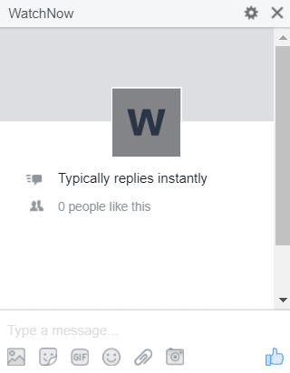

 

## WatchNow Messenger Bot with DialogFlow (API.AI)

  

## Environment variables

* DIALOG_FLOW_TOKEN
* VERIFY_TOKEN
* PAGE_ACCESS_TOKEN

## How to setup

- [Messenger Bot with DialogFlow & Golang](http://www.blog.labouardy.com/bot-in-messenger-with-dialogflow-golang/)

## Maintainers

- Mohamed Labouardy - mohamed@labouardy.com

## License

This project is licensed under the MIT License - see the [LICENSE](LICENSE) file for details
